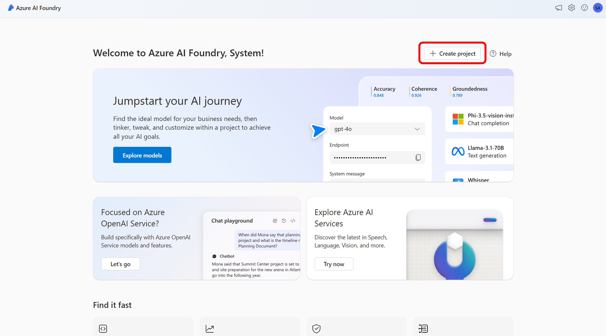
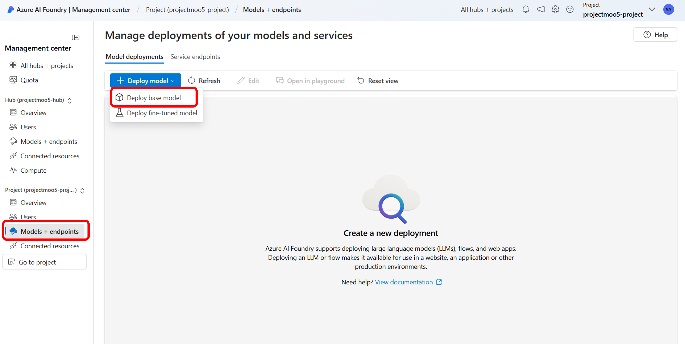

# Step 1. Azure AI Foundry 포털에서 Prompt Flow 생성하기

Prompt Flow는 LLM을 기반으로 하는 AI 애플리케이션의 전체 개발 주기를 간소화하도록 설계된 개발 도구입니다. Prompt Flow는 AI 애플리케이션의 프로토타입 제작, 실험, 반복 및 배포 프로세스를 간소화하는 포괄적인 솔루션을 제공합니다.

Prompt Flow를 사용하면 다음을 수행할 수 있습니다.

- 시각화된 그래프를 통해 LLM, 프롬프트 및 Python 도구를 연결하는 실행 가능한 흐름을 오케스트레이션합니다.
- Flow를 쉽게 테스트, 디버그 및 반복합니다.
- Prompt Variants를 만들고 각 Variants의 성능을 비교합니다.

본 실습 단계에서는 Azure AI Foundry 포털에서 Prompt Flow를 만들고 개발하는 방법을 알아봅니다.

## Prompt Flow 생성을 위한 사전 준비

### Azure AI Foundry 프로젝트 만들기

1. [Azure AI Foundry Portal](https://ai.azure.com/)으로 접속하여 새 프로젝트 만들기를 합니다. 

    

2. 먼저, 프로젝트의 이름을 입력합니다. 이미 허브가 있는 경우에는 가장 최근에 선택한 허브가 표시됩니다. 새 허브를 만들려면 "새 허브 만들기"를 선택하고 이름을 입력합니다. 

    

3. 허브 사용자 지정을 위하여 "Customize" 버튼을 클릭합니다. 

    

4. 리소스 그룹과 지역을 입력하고 새로운 AI Service를 생성합니다.

    

5. 리뷰 후 생성 버튼을 클릭합니다.

    

6. 생성이 완료된 후 Azure Portal의 리소스그룹을 보면 AI Foundry Project, AI Foundry Hub, AI Service 리소스와 Dependent (종속성) 리소스 중 필수 리소스인 Azure Storage Account와 Key Vault가 생성된 것을 확인 할 수 있습니다.

    

### 사용자 계정에 Storage Blob 데이터 기여자 역할을 할당

1. Azure AI Foundry 포털 왼쪽 아래의 "Management Center(관리센터)"를 선택합니다.

    

2. 프로젝트에 Connecte Resources(연결된 리소스)에서 Azure Blob Storage 유형에 해당하는 링크를 선택합니다.

    

3. Azure Portal에서 보기를 선택합니다.

    

4. Azure Portal에서 액세스 제어 (IAM)를 선택하고 "역할 할당 추가"를 선택합니다.

    

5. "Storage Blob Data Contributor"를 선택합니다.

    

6. Member 추가에 자신을 구성원으로 추가한 후 "검토 + 할당"을 선택하여 역할을 할당합니다.

    

### AI 모델 배포

1. Project 아래의 "Models + endpoints" 메뉴에서 "Deploy Model"을 선택하고 "Deploy base model"을 선택하여 AI 모델을 배포합니다.

    

2. 이번 실습에서는 Azure OpenAI의 gpt-4o-mini을 배포하여 사용하도록 하겠습니다.

    

3. 배포 타입은 Standard로 Azure AI Foundry의 Project와 동일한 지역을 선택합니다.

    

4. 모델 배포를 확인합니다.

    

### Compute Sesson 만들기

Prompt Flow를 실행하려면 컴퓨팅 세션이 필요합니다. Prompt Flow의 컴퓨팅 세션에는 종속성 패키지를 포함한 Docker 이미지를 포함하여 애플리케이션을 실행하는데 필요한 컴퓨팅 리소스가 있습니다. Flow의 실행 외에도 Azure AI Foundry는 컴퓨팅 세션을 사용하여 프롬프트 또는 코드 콘텐츠를 업데이트할 때 Flow 내에 통합된 도구의 정확도와 기능을 보장합니다.

1. "Management Center" (관리센터)로 들어가서 "Compute" 메뉴를 선택한 후 "New"로 새로운 Compute 리소스를 생성합니다.

    

2. 본 실습에서는 CPU로 추천하는 옵션을 선택하도록 하고 리뷰 후 생성합니다.

    

3. Compute 리소스 생성 후 "Running" 상태로 실행되는 것을 확인합니다.

    

## Prompt Flow 만들기

Prompt Flow는 갤러리에서 샘플을 복제하거나 처음부터 Flow를 만드는 방식으로 생성할 수 있습니다. 이미 Flow 파일이 로컬이나 파일 쉐어에 있는 경우에는 Import하여 Flow를 생성할 수도 있습니다. 본 실습 과정에서는 Standard Flow를 처음부터 만드는 방식으로 Prompt Flow를 만들어 보도록 하겠습니다.

1. Azure AI Founrty 포털의 프로젝트에서 Prompt Flow를 생성합니다.

    

2. 이번 단계에서는 Standard Flow로 간단히 Prompt Flow를 생성하고 어떻게 동작하는지 살펴보도록 하겠습니다. Standard Flow를 선택하여 생성합니다.

    

3. Flow가 생성되면 Graph에 Inputs, joke, echo, Outputs가 연결된 Flow를 보실 수 있습니다. 우측 상단에서 Compute session을 시작합니다.

    

4. joke 노드에서 Connection과 Deployment name을 선택합니다. 이전 단계에서 배포한 gpt-4o-mini를 선택합니다.

    

5. Input의 topin에 "atoms" 라는 단어를 넣고 우측 상단의 "Run"을 클릭하여 Prompt Flow를 실행합니다.

    

6. "View outputs"를 클릭하여 Output을 확인합니다.

    

7. atoms라는 Input에 대한 Joke를 생성하여 출력된 결과를 볼 수 있습니다.

    

## 실습 순서

* [Step 1. Azure AI Foundry 포털에서 Prompt Flow 생성하기](https://github.com/jeongaelee/ProjectMooModule5/blob/main/Step1.md)
* [Step 2. Visual Studio Code에서 Prompt Flow의 Chat Flow를 생성하고 DeepSeek-R1 모델을 연결하기](https://github.com/jeongaelee/ProjectMooModule5/blob/main/Step2.md)
* [Step 3. web-classification flow를 이해하고 Python Code에서 실행해보기](https://github.com/jeongaelee/ProjectMooModule5/blob/main/Step3.md)
