# Step 2. Visual Studio Code에서 Prompt Flow의 Chat Flow를 생성하고 DeepSeek-R1 모델을 연결하기

이번 실습 과정에서는 [마이크로소프트에서 제공하는 Prompt Flow](https://github.com/microsoft/promptflow)의 샘플을 활용하여 Visual Studio Code의 Prompt Flow Extension으로 프롬프트 플로우를 구성하는 방법에 대해서 실습해봅니다. 본 실습 과정은 개발 환경이 사전에 셋팅되어있는 GitHub Codespaces를 사용하거나 로컬에 코드를 다운 받아서 Visual Studio Code에서 실행하면 됩니다. 

이번 단계에서는 Visual Studio Code로 로컬에서 Prompt Flow를 구성하고 실행하는 방법을 가이드 합니다. GitHub Codespaces를 사용하고자 하시는 분은 아래 버튼을 눌러서 바로 Codespaces에서 실습을 하시면 됩니다. (동일하게 동작합니다.)

[](https://codespaces.new/microsoft/promptflow?quickstart=1)

## Prompt Flow Sample GitHub 다운로드 및 환경 설정

1. [마이크로소프트의 Prompt Flow](https://github.com/microsoft/promptflow) GitHub에 들어가서 실습에 필요한 Code를 다운로드 합니다. 아래의 git 명령어로 repository를 clone 하거나, 코드를 zip 파일로 다운로드 받습니다.

    ```
    git clone https://github.com/microsoft/promptflow.git
    ```

2. Python 환경이 설치되어있는지 확인합니다.`python>=3.9, <=3.11` is recommended.

    ```
    pip install promptflow promptflow-tools
    ```

## Visual Studio에 Prompt Flow 설치하기

1. Visual Studio Code에 [Prompt flow for VS Code](https://marketplace.visualstudio.com/items?itemName=prompt-flow.prompt-flow) extension을 설치합니다.

2. Python 실행환경을 설치한 `python>=3.9, <=3.11` 버전으로 선택합니다.

## DeepSeek-R1 모델 배포하기

이번 단계에서는 DeepSeek-R1을 Serverless API로 배포합니다.

1. Project 아래의 "Models + endpoints" 메뉴에서 "Deploy Model"을 선택하고 "Deploy base model"을 선택 합니다.

    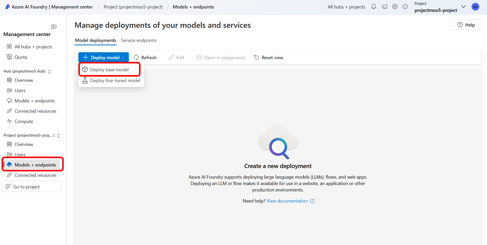

2. "DeepSeek"로 검색하여 DeepSeek-R1 모델을 선택합니다.

    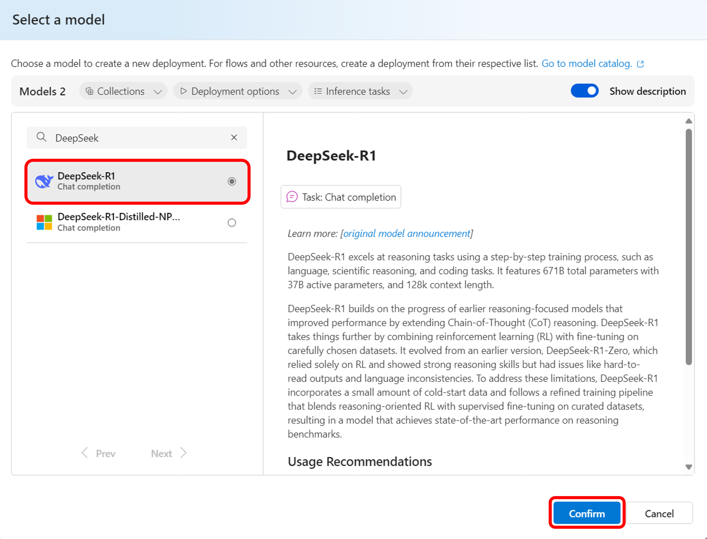

3. Deployment name을 입력하고 Deploy 합니다.

    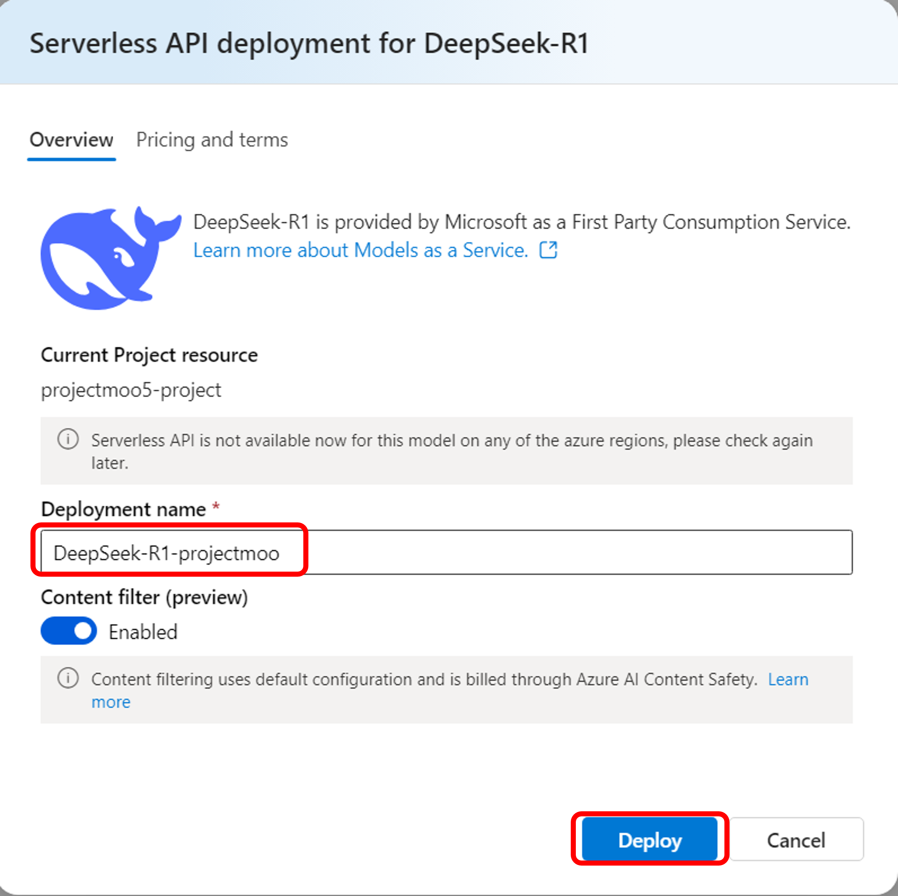

4. 배포된 모델의 endpoint와 key를 복사합니다.

    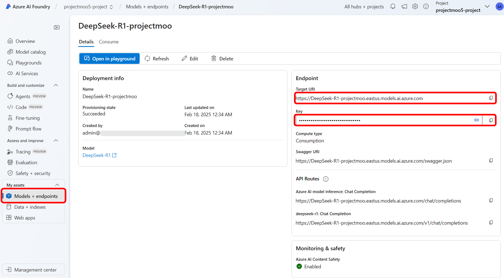

* [Note] Azure AI Foundry Portal에서 모델이 Serverless로 배포되지 않는 계정이 있습니다. 이때는 [서버리스 API 엔드포인트에 모델 배포를 CLI로 배로하는 옵션](https://learn.microsoft.com/ko-kr/azure/ai-studio/how-to/deploy-models-serverless?tabs=cli#deploy-the-model-to-a-serverless-api-endpoint)으로 진행을 해보시기 바랍니다. 순서는 아래와 같습니다.

1.  CLI는 Azure Portal의 Cloud Shell을 이용하면 간단하게 실행할 수 있습니다.

    

2. 아래의 Azure CLI 명령어로 subscription과 workspace, group, location을 설정합니다.

    ```
    az account set --subscription <subscription>
    az configure --defaults workspace=<project-name> group=<resource-group> location=<location>
    ```

3. 아래와 같이 모델의 name과 model_id를 endpoint.yml이라는 이름으로 저장합니다.

    ```
    name: DeepSeek-R1-project-moo
    model_id: azureml://registries/azureml-deepseek/models/DeepSeek-R1
    ```

4. 아래의 Azure CLI 명령어를 실행하여 endpoint.yml 파일을 사용하여 엔드포인트를 만듭니다.

    ```
    az ml serverless-endpoint create -f endpoint.yml
    ```

## DeepSeek-R1 모델을 Serverless Connection으로 설정하기

1. Prompt Flow에서 위에서 디플로이한 DeepSeek 모델을 연결하기 위하여 Connection을 추가합니다. VS Code의 좌측 메뉴에서 "P" 모양의 Prompt Flow 아이콘을 클릭합니다. 다운로드 받은 Flow와 Tool의 리스트 등을 보실 수 있습니다. 맨 아래쪽에는 Connection을 생성하고 관리할 수 있는 패널이 있습니다. 이 패널에서 Serverless connection의 오른쪽 "+"를 클릭하여 connection을 설정하는 yaml 파일을 수정합니다.

    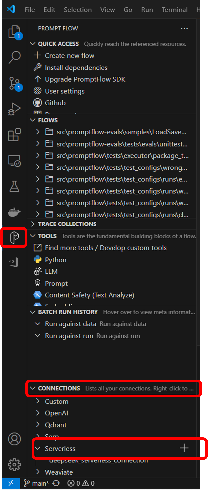

2. 적절한 "name"을 입력하고, "api_base" 위 단계에서 복사한 DeepSeek-R1 모델의 endpoint를 입력합니다. "api_key"는 반드시 "<user_input>"으로 남겨 놓고, Create connection"을 실행하면 입력하도록 합니다. "Create connection"을 클릭하여 Serverless Connection을 생성합니다. 

    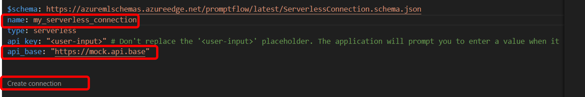

* Note: "Create connection" 단계에서 "Connection creation failed with StoreConnectionEncryptionKeyError" 에러가 발생하면 아래의 명령어로 keyrings.alt를 인스톨해주세요. (참고: [Connection creation failed with StoreConnectionEncryptionKeyError](https://microsoft.github.io/promptflow/how-to-guides/faq.html#connection-creation-failed-with-storeconnectionencryptionkeyerror))

    ```
    pip install keyrings.alt
    ```

## Basic Chat Flow에 연결한 DeepSeek-R1을 통하여 채팅 답변 받기

1. "FLOWS" 패널에서 샘플 prompt flow를 오픈합니다. 이번 실습은 기본 Chat Flow로 진행합니다. "examples\flow\chat\chat-basic" FLOW를 "Open" 합니다.

    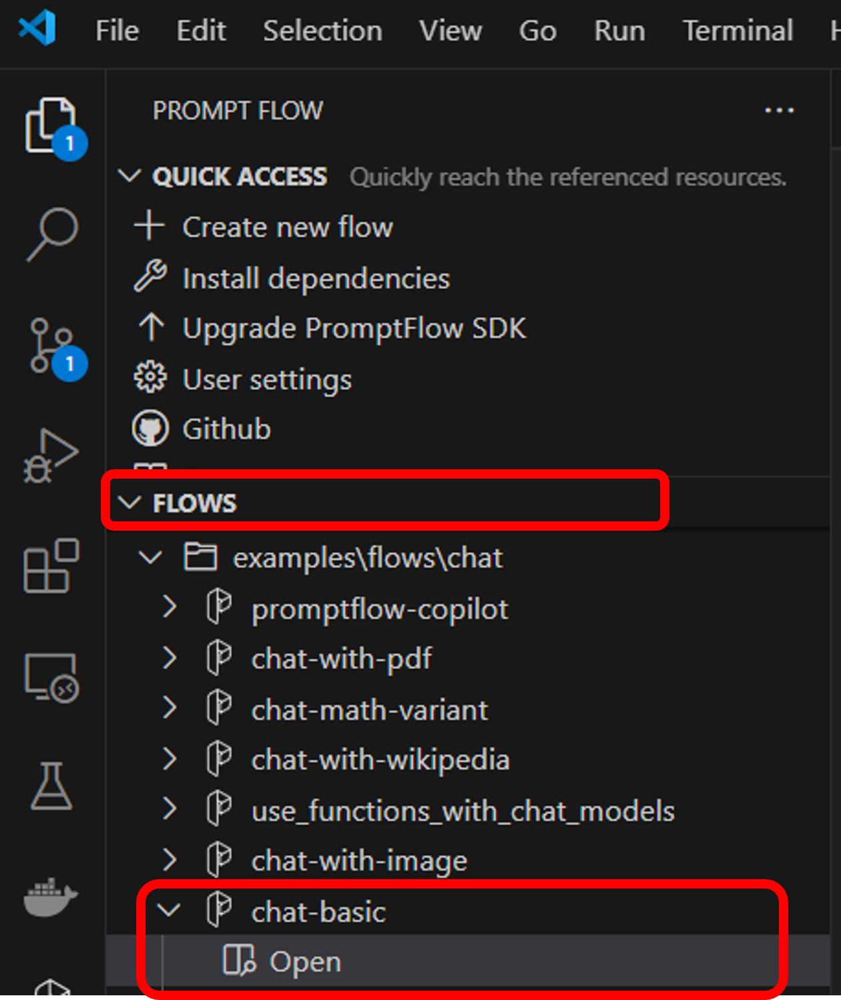

2. 기본 Chat FLOW에 input, chat, output 노드로 구성되어있는 것을 보실 수 있습니다. chat 노드를 선택 한 후 "connection:"을 위에서 생성한 Serverless Connection으로 선택합니다.

    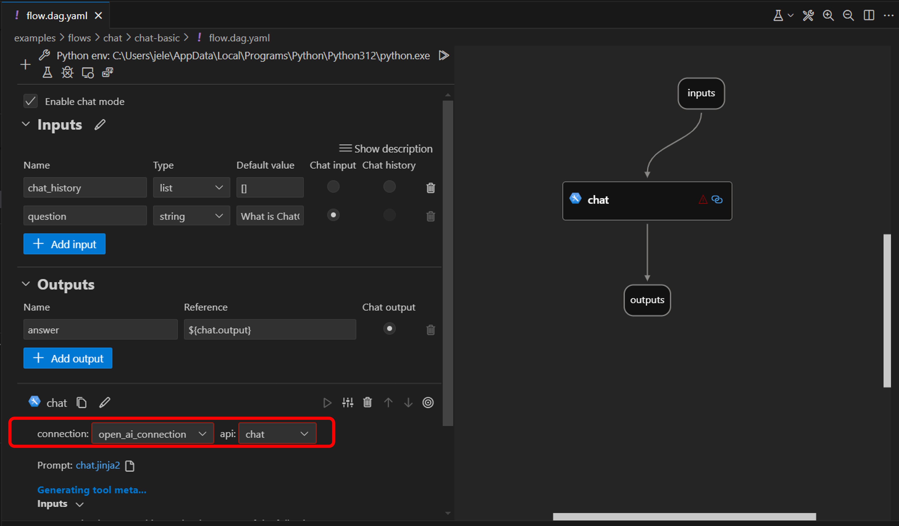

    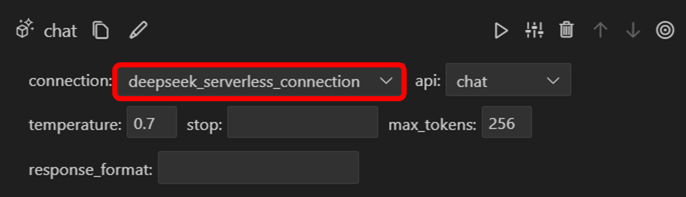

3. "Input"의 "question" 값에 질문을 입력합니다. (예: "Which LLM model is answering the response?") 삼각형 모양의 "Run All" 버튼을 클릭하여 Flow를 실행합니다.

    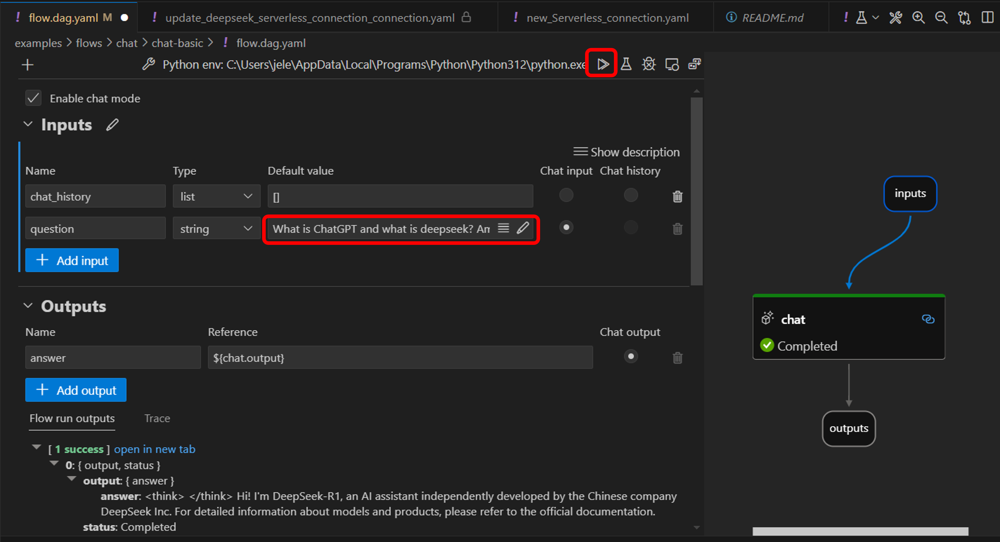

4. DeekSeek-R1 모델이 응답한 답변을 확인합니다.

    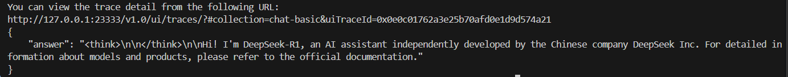

5. Prompt Flow의 노드면 실행 결과를 확인합니다.

    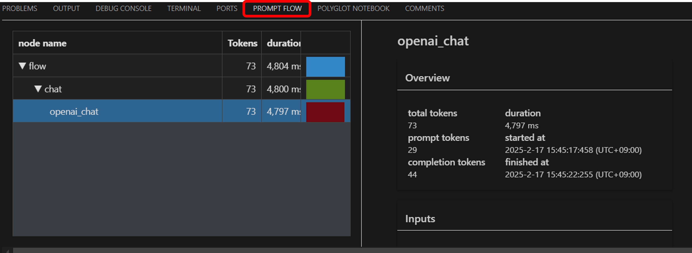

## 실습 순서

* [Step 1. Azure AI Foundry 포털에서 Prompt Flow 생성하기](https://github.com/jeongaelee/ProjectMooModule5/blob/main/Step1.md)
* [Step 2. Visual Studio Code에서 Prompt Flow의 Chat Flow를 생성하고 DeepSeek-R1 모델을 연결하기](https://github.com/jeongaelee/ProjectMooModule5/blob/main/Step2.md)
* [Step 3. web-classification flow를 이해하고 Python Code에서 실행해보기](https://github.com/jeongaelee/ProjectMooModule5/blob/main/Step3.md)
