# Step 3. web-classification flow를 이해하고 Python Cdoe에서 실행해보기

이번 실습 과정에서는 [마이크로소프트에서 제공하는 Prompt Flow](https://github.com/microsoft/promptflow)의 샘플 중 web-classification을 실행하여 flow의 노드들에 대해 이해해보고, VS Code Extension에서 동작해 본다.

## web-classification FLOW를 이해하고 실행하기

이번 단계에서는 DAG(Directed Acylic Graph) Flow의 예제인 web-classification flow를 이해하고 Visual Studio Code에서 실행해봅니다.

1. Visual Studio Code의 Prompt Flow 아이콘을 클릭하고, examples\flows\standard 폴더의 web-classification FLOW를 오픈합니다.

    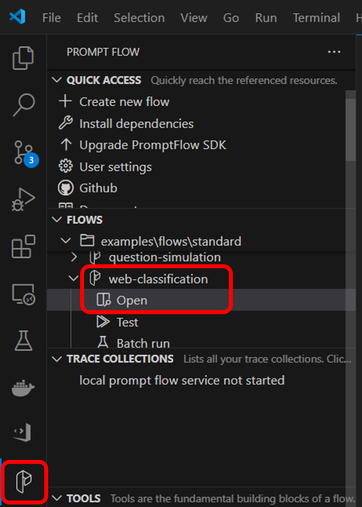

2. flow.dag.yaml 파일에는 아래와 같이 DAG(Directed Acylic Graph)에 대한 flow가 있습니다. Input/Output과 Node들에 대한 정의를 확인할 수 있습니다.

    

3. 오른쪽의 그래프를 보고 각각의 노드가 어떤 역할을 하는지 살펴봅니다.

    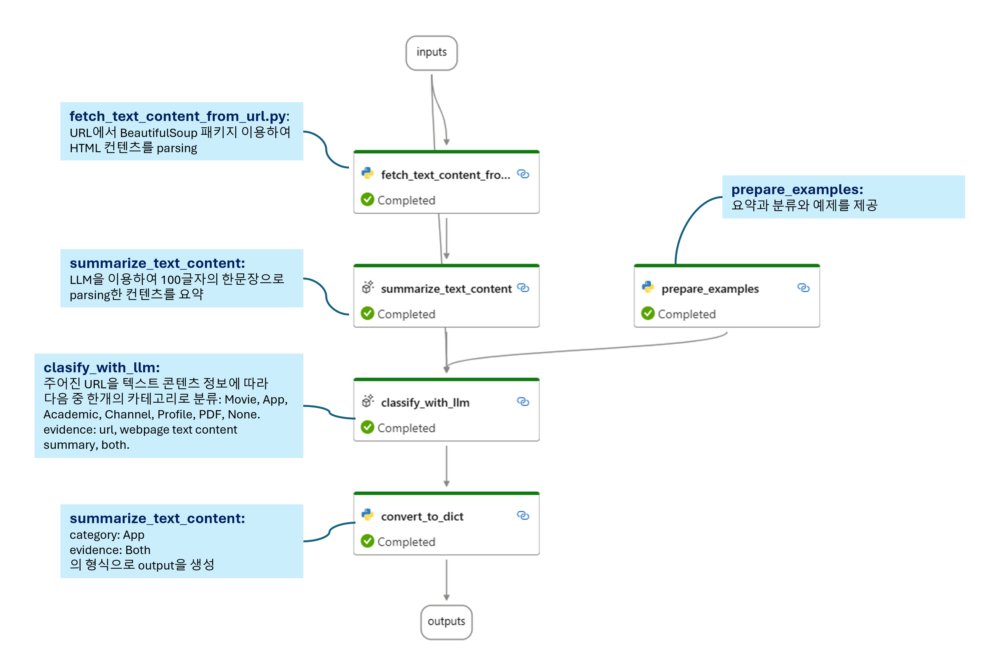

## Azure OpenAI 리소스 생성, 모델 배포 및 Connection 생성

summarize_text_content와 clasify_with_llm 노드에서 결과를 생성하기 위해서는 LLM과의 Connection이 필요합니다. 이 단계에서는 Azure OpenAI 리소스를 생성하고 gpt-4o 모델을 배포하여 노드에서 연결해보도록 하겠습니다.

1. [Azure Portal](https://portal.azure.com/)으로 접속하여 새 리소스 만들기를 합니다. azure openai로 검색하여 Azure OpenAI 리소스를 생성합니다.

    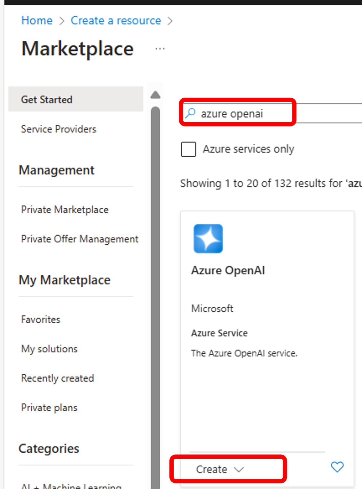

2. Resource group을 새로 만들고, Region을 선택하고, 이름과 가격 티어를 입력한 후 Next를 누르고 나머지 항목은 기본값으로 유지한 후 Azure OpenAI 리소스를 생성합니다.

    

3. "Go to Azure AI Foundry portal을"를 클릭하여 Azure AI Foundry portal을 오픈합니다.

    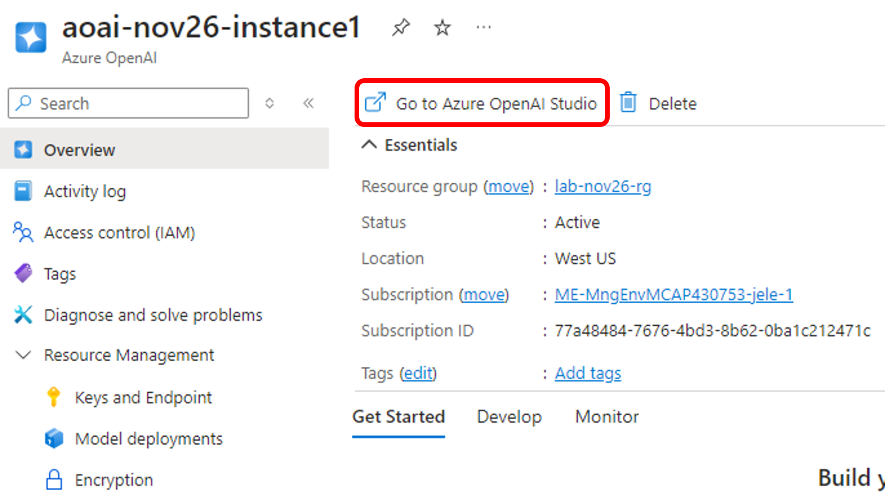

4. 모델을 배포합니다. "Deployments" 메뉴에서 "+ Deploy model"을 클릭하고 "Deploy base model"을 선택합니다.

    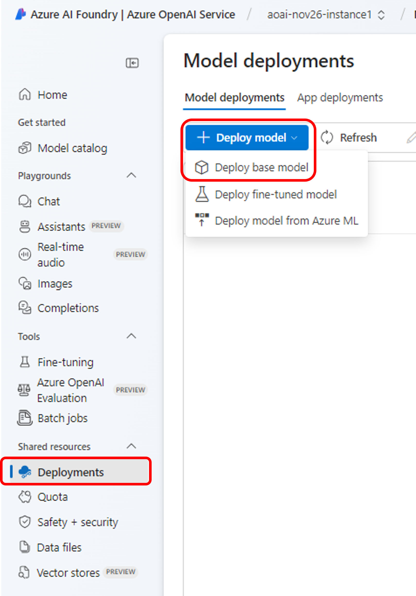

5. 본 실습에서는 gpt-4o 모델을 배포하도록 하겠습니다.

    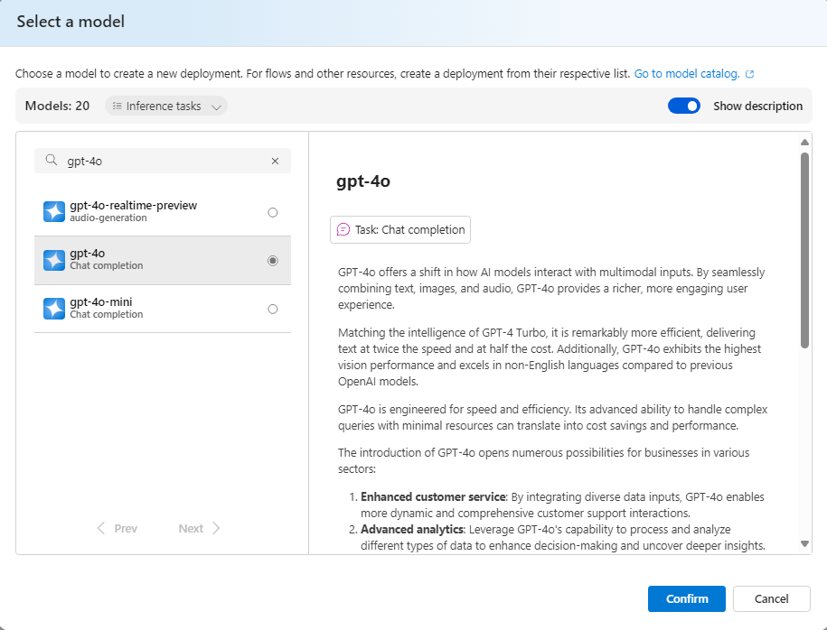

6. Deployment name에 "gpt-4o"를 입력하고, Deployment type은 "Standard"로 선택합니다. 나머지 항목은 기본값으로 유지한 후 "Deploy" 버튼을 누릅니다.

    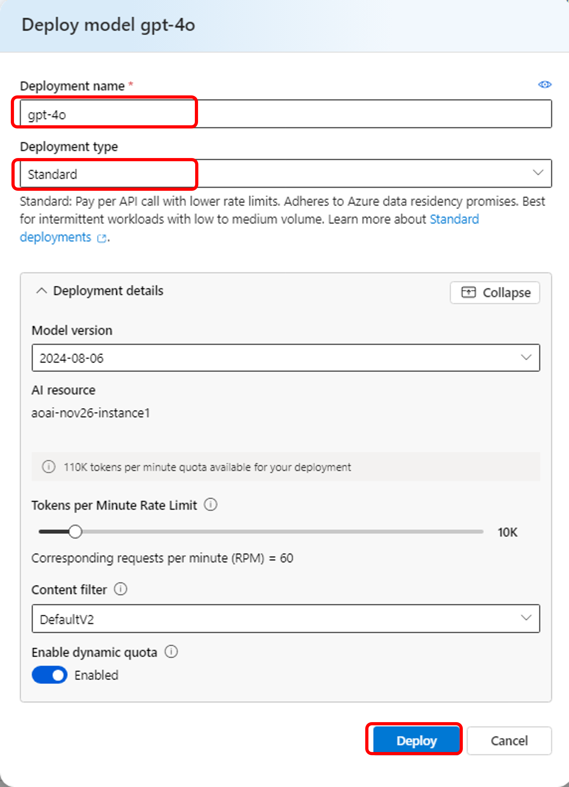

7. 생성된 Azure OpenAI 리소스로 이동합니다. "Resource Management" 아래의 "Key and Endpoint" 메뉴를 클릭하면 Azure OpenAI 리소스의 API-Key와 Endpoint를 복사할 수 있습니다.

    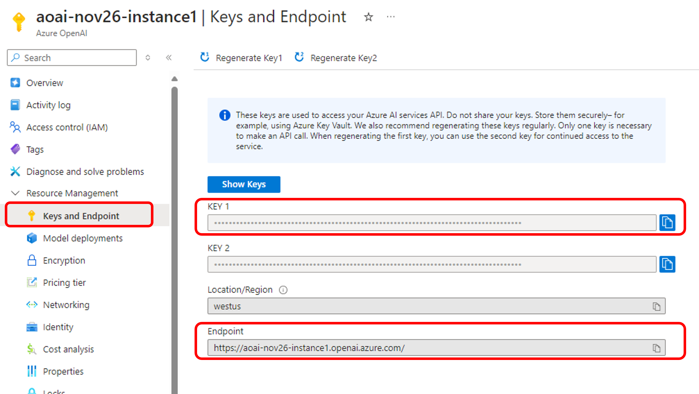

8. FLOW에 Azure OpenAI Connection을 생성합니다. "CONNECTIONS" 패털에서 "Azure OpenAI" 항목 옆에 있는 "+" 버튼을 클릭하여 connection을 설정하는 yaml 파일을 수정합니다.

    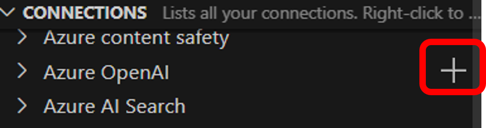

9. "aoai_connection"과 같은 적절한 "name"을 입력하고, "api_base" 위 단계에서 복사한 Azure OpenAI의 endpoint를 입력합니다. "api_version"에는 "2024-02-15-preview"를 입력합니다. "api_key"는 반드시 "<user_input>"으로 남겨 놓고, Create connection"을 실행하면 입력하도록 합니다. "Create connection"을 클릭하여  Connection을 생성합니다. 

    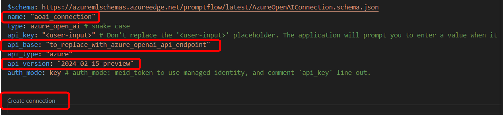

10. Connection이 생성되면 summarize_text_content와 clasify_with_llm 노드의 connection과 deployment_name을 입력합니다. summarize_text_content에는 두개의 variant 값에 모두 설정해주세요.

    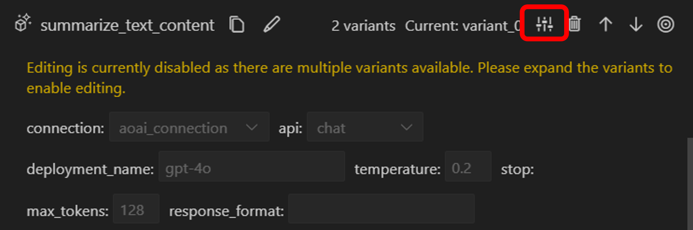

    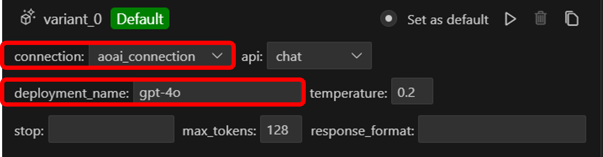

    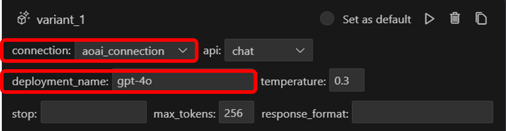

    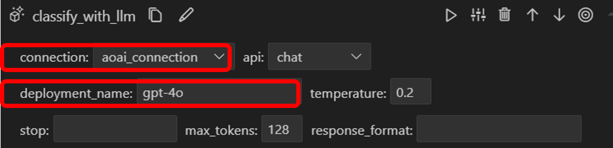

11. Connection 설정이 끝났으면, FLOW를 전체 실행합니다. 

    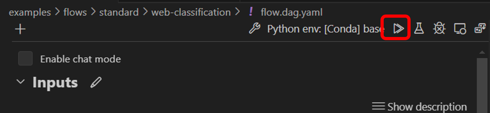

Note: Flow 실행 중 아래의 에러가 날 경우에 requirements.txt를 설치해주시기 바랍니다.

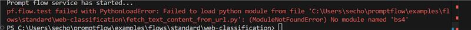

```
pip install -r requirements.txt
```

12. Default variant만 사용할 것인지 모든 variant를 사용할 것인지 선택한 후 실행합니다.

    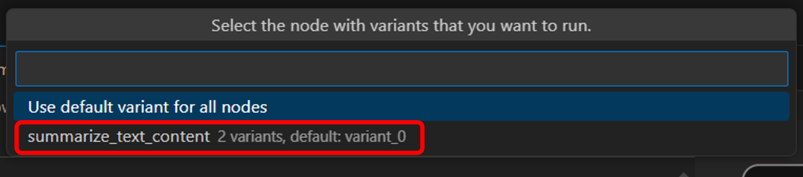

13. 실행이 완료되면 Output에서 결과를 확인 할 수 있습니다.

    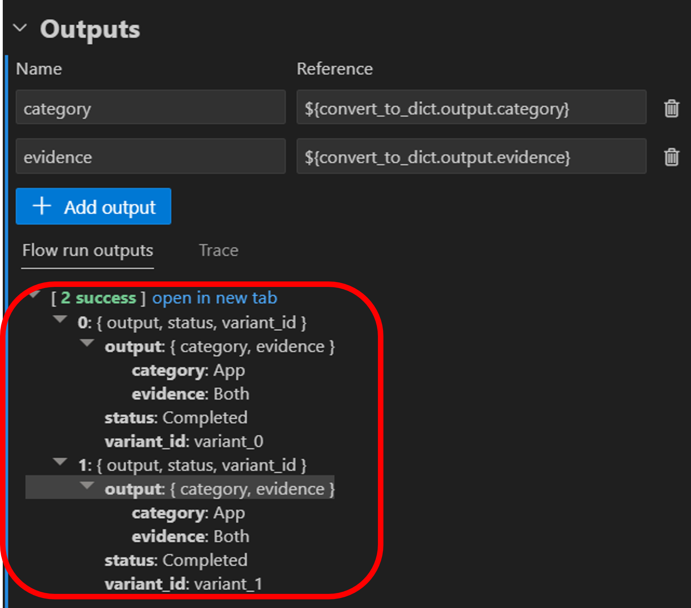

14. Visual Studio Code 아래쪽의 "PROMPT FLOW" 탭으로 가시면 실행 시간, Input, Output을 확인할 수 있습니다.

    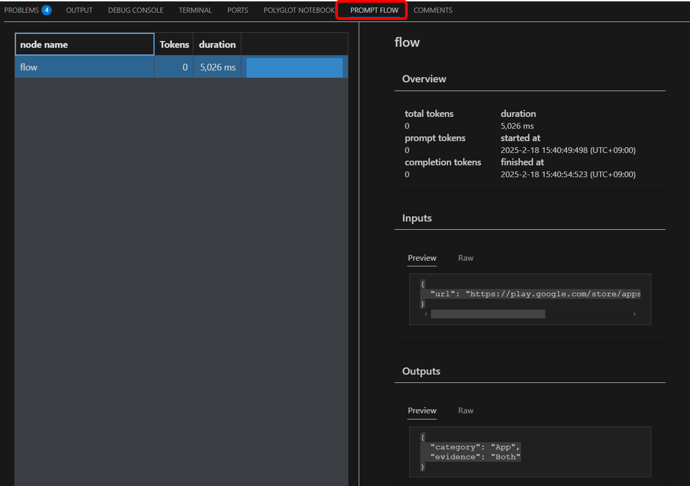

## Python 코드에서 Connection을 연결하고 web-classification flow를 실행하기

이번 단계에서는 "examples/tutorials/get-started/quickstart.ipynb"의 예제로 Python 코드에서 Connection을 생성/연결하고, web-classification flow를 실행하고 평가하는 과정을 수행해봅니다.

1. "examples/tutorials/get-started/quickstart.ipynb" 파일을 열어서 각각의 과정을 수행합니다.


2. [Optional] 파이썬 노트북의 "1. Create necessary connections" 단계를 실행할때, 아래의 connection을 설정하는 코드에서 이전 단계에서 생성한 "aoai_connection"을 사용하도록 아래와 같이 코드를 수정해 줍니다.

    ```
    try:
        conn_name = "aoai_connection"
        conn = pf.connections.get(name=conn_name)
        print("using existing connection")
    except:
        # Follow https://learn.microsoft.com/en-us/azure/ai-services/openai/how-to/create-resource?pivots=web-portal to create an Azure OpenAI resource.
        #connection = AzureOpenAIConnection(
        #    name=conn_name,
        #    api_key="<test_key>",
        #    api_base="<test_base>",
        #    api_type="azure",
        #    api_version="<test_version>",
        #)

        # use this if you have an existing OpenAI account
        connection = OpenAIConnection(
            name=conn_name,
            api_key="<user-input>",
        )

        conn = pf.connections.create_or_update(connection)
        print("successfully created connection")

    print(conn)
    ```

## 실습 순서

* [Step 1. Azure AI Foundry 포털에서 Prompt Flow 생성하기](https://github.com/jeongaelee/ProjectMooModule5/blob/main/Step1.md)
* [Step 2. Visual Studio Code에서 Prompt Flow의 Chat Flow를 생성하고 DeepSeek-R1 모델을 연결하기](https://github.com/jeongaelee/ProjectMooModule5/blob/main/Step2.md)
* [Step 3. web-classification flow를 이해하고 Python Code에서 실행해보기](https://github.com/jeongaelee/ProjectMooModule5/blob/main/Step3.md)
